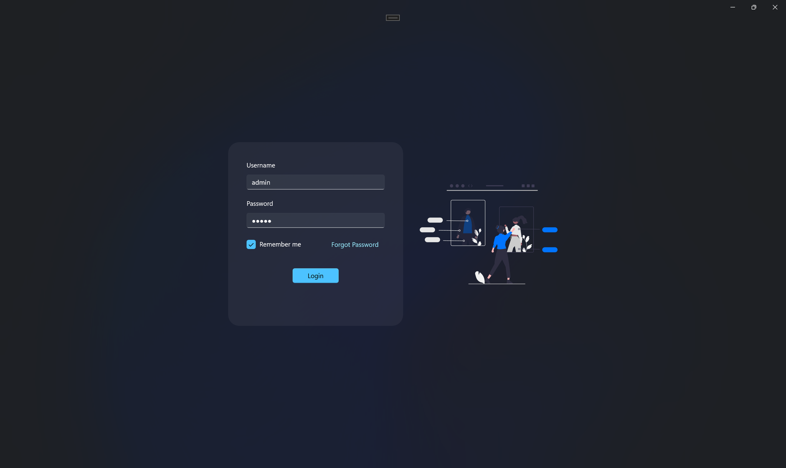
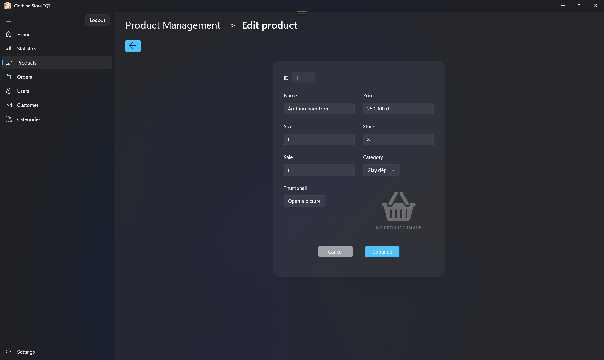
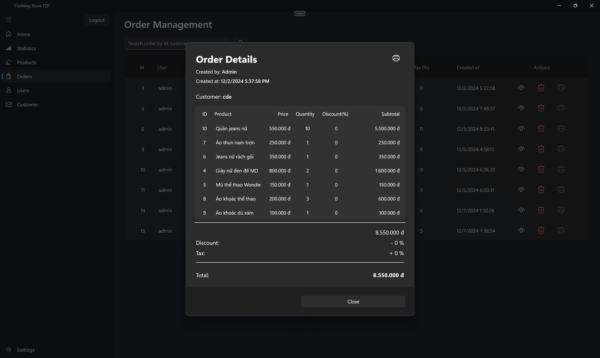
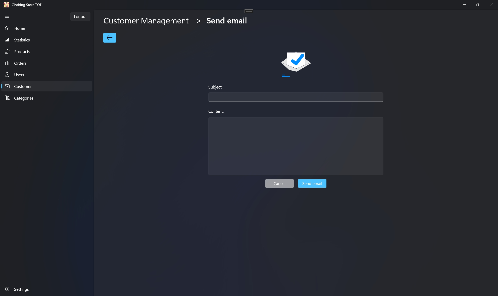
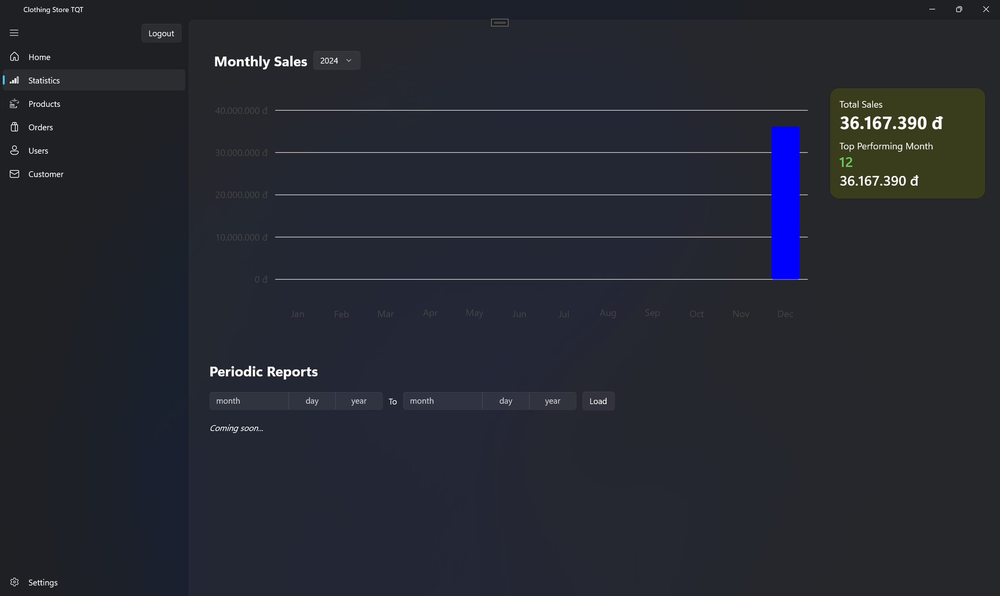
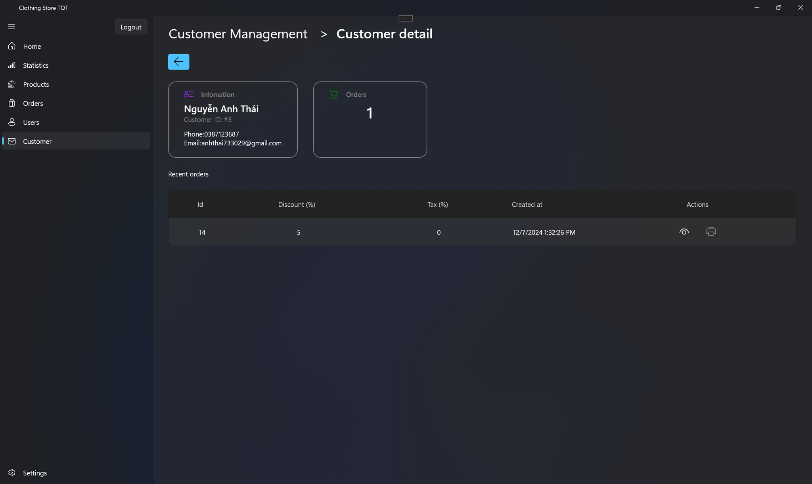

# Clothing Store POS

## Introduction

MSSV: 21120317-21120331-21120359

## Các chức năng được phát triển

- Đăng nhập, nhớ tài khoản đăng nhập
- Quản lý sản phẩm, danh sách sản phẩm, thêm, xóa, sửa, tìm kiếm sản phẩm, phân trang
- Quản lý nhân viên, danh sách nhân viên, thêm, xóa, sửa, phân trang, tìm kiếm (cập nhập trong milestone 2)
- Trang chủ
- Tạo đơn hàng mới cùng với thông tin khách hàng, thêm khuyến mãi, thuế, xuất file hóa đơn dạng pdf (cập nhật trong milestone 2)
- Quên mật khẩu (milestone 2)
- Quản lý khách hàng, tạo, xóa, sửa, phân trang, tìm kiếm khách hàng, xem thông tin chi tiết (milestone 2)
- Gửi email cho khách hàng (milestone 2)
- Phân quyền cho nhân viên (milestone 2)
- Nhập và xuất file csv (milestone 2)
- Quản lý đơn hàng, xóa, xem chi tiết, phân trang, tìm kiếm (milestone 2)
- Thống kê số liệu cơ bản (milestone 2)
- Thống kê theo thời gian (milestone 3)
- Tích hợp ví điện tử (milestone 3)
- Quản lý doanh mục (milestone 3)
- Push notification khi sản phẩm gần hết hàng (milestone 3)

## Hướng dẫn cách dùng

1. Sử dụng lệnh docker-compose up để start postgres database.
2. Mở project trong Visual Studio để khởi chạy ứng dụng.

## Một vài hình ảnh giao diện ứng dụng (cập nhập thêm milestone 2)

1. Đăng nhập
   
2. Chỉnh sửa sản phẩm
   
3. Quản lý đơn hàng
   
4. Gửi email
   
5. Quản lý số liệu
   
6. Chi tiết khách hàng
   

## Advanced topic

1. Sử dụng Entity Framework Core (ORM) để thao tác với database
2. Xử lý lưu trữ hình ảnh sản phẩm
3. Xử lý nhập xuất file csv (milestone 2)
4. Xử lý tạo và xuất file pdf (milestone 2)
5. Tìm hiểu thư viện LiveCharts2 để vẽ đồ thị (milestone 2)
6. Tìm hiểu và xử lý gửi email thông qua email service (milestone 2)
7. Tích hợp với ví điện tử VNPay (milestone 3)
8. Tạo http listener trong ứng dụng WinUI 3 (milestone 3)

## Kiến trúc phần mềm

1. Sử dụng mô hình MVVM
2. Sử dụng các DAOs để giao tiếp và định nghĩa các phương thức giao tiếp với database

## Quá trình làm việc nhóm (Updated for milestone 2)

1. Git flow: https://github.com/quocng777/clothing-store-pos/commits/main/
2. Phân công công việc

   | Thành viên | Công việc                                                                                           | Status     | Thời gian làm việc |
   | ---------- | --------------------------------------------------------------------------------------------------- | ---------- | ------------------ |
   | 21120317   | Chức năng liên quan đến quản lý sản phẩm                                                            | Hoàn thành | 6h                 |
   | 21120331   | Trang chủ, tạo đơn hàng                                                                             | Hoàn thành | 6h                 |
   | 21120359   | Chức năng liên quan đến nhân viên                                                                   | Hoàn thành | 6h                 |
   | 21120317   | Chức năng liên quan quản lý khách hàng, gửi email cho khách hàng (milestone 2)                      | Hoàn thành | 5h                 |
   | 21120331   | Chức năng tạo đơn với khách hàng, xuất hóa đơn, quản lý đơn hàng, thống kê số liệu (milestone 2)    | Hoàn thành | 5h                 |
   | 21120359   | Quên mật khẩu, phân quyền, nhập và xuất file csv (đã cài hàm nhưng chưa có giao diện) (milestone 2) | Hoàn thành | 5h                 |
   | 21120317   | Tích hợp thanh toán bằng ví điện tử vào thanh toán đơn hàng (milestone 3) | Hoàn thành | 4h                 |
   | 21120331   | Thông kê thông tin theo thời gian, thêm tính năng note cho từng đơn hàng (milestone 3)    | Hoàn thành | 4h                 |
   | 21120359   | Quản lí danh mục, push notification khi product gần hết hàng, UI cho import/export CSV (milestone 3) | Hoàn thành | 4h                 |

## VIDEO DEMO

Link milestone 2: [Youtube](https://youtu.be/ewFVTqwSe_Q)\
Link milestone 3: [Youtube](https://youtu.be/rUD4UR8IiRA)

## Đảm bảo chất lượng

1. Tạo các nhánh feature để thực hiện các chức năng\
   Link github: https://github.com/quocng777/clothing-store-pos/branches
2. Tạo các pull request để review code, trước khi merge vào nhánh main
3. Tạo file google sheeet quản lý và theo dõi một số tese case để kiểm thử các chức năng cơ bản của ứng dụng (manual testing)

## Account Test

- Username: `admin`
- Password: `Passw0rd!!`
