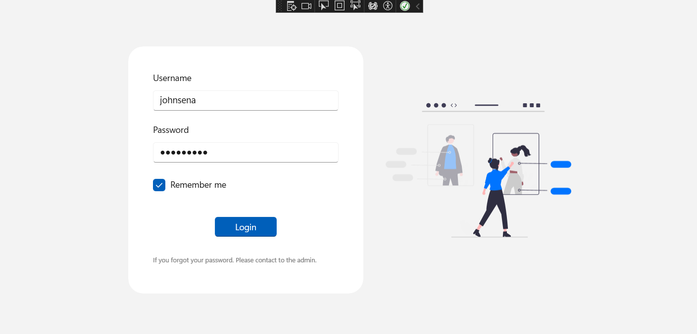
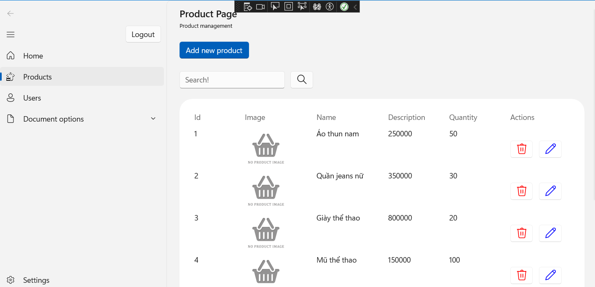
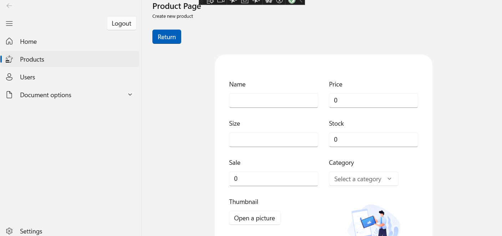

# Clothing Store POS

## Introduction
MSSV: 21120317-21120331-21120359

## Các chức năng được phát triển
- Đăng nhập, nhớ tài khoản đăng nhập
- Quản lý sản phẩm, danh sách sản phẩm, thêm, xóa, sửa, tìm kiếm sản phẩm, phân trang
- Quản lý nhân viên, danh sách nhân viên, thêm, xóa, sửa, phân trang
- Trang chủ
- Tạo đơn hàng mới

## Hướng dẫn cách dùng
1. Sử dụng lệnh docker-compose up để start postgres database
2. Mở project trong Visual Code để khởi chạy ứng dụng.

## Một vài hình ảnh giao diện ứng dụng
1. Đăng nhập

2. Quản lý sản phẩm

3. Tạo mới sản phảm

## Advanced topic
1. Sử dụng Entity Framework Core (ORM) để thao tác với database
2. Xử lý lưu trữ hình ảnh sản phẩm

## Kiến trúc phần mềm
1. Sử dụng mô hình MVVM
2. Sử dụng các DAOs để giao tiếp và định nghĩa các phương thức giao tiếp với database

## Quá trình làm việc nhóm
1. Git flow: https://github.com/quocng777/clothing-store-pos/commits/main/
2. Phân công công việc
    
    | Thành viên | Công việc                                    | Status    | Thời gian làm việc |
    |------------|----------------------------------------------|----------|--------------------|
    | 21120317   | Chức năng liên quan đến quản lý sản phẩm     |Hoàn thành|6h                  |
    | 21120331   | Chức năng liên quan đến nhân viên            |Hoàn thành|6h                  |
    | 21120359   | Trang chủ, tạo đơn hàng                      |Hoàn thành|6h                  |

## Đảm bảo chất lượng
1. Tạo các nhánh feature để thực hiện các chức năng
Link github: https://github.com/quocng777/clothing-store-pos/branches
2. Tạo các pull request để review code, trước khi merge vào nhánh main

## Account Test
- Username: `admin`
- Password: `Passw0rd!!`